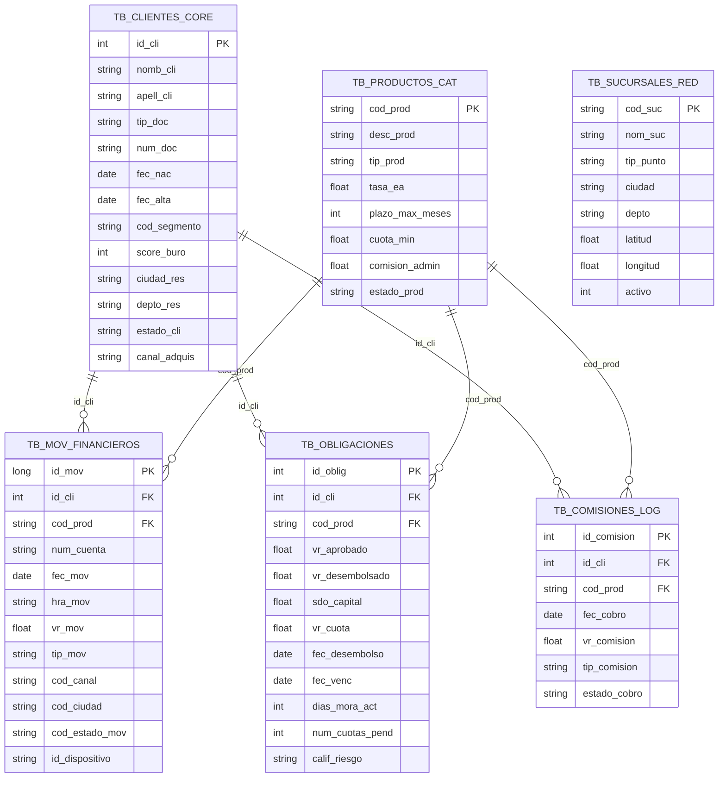
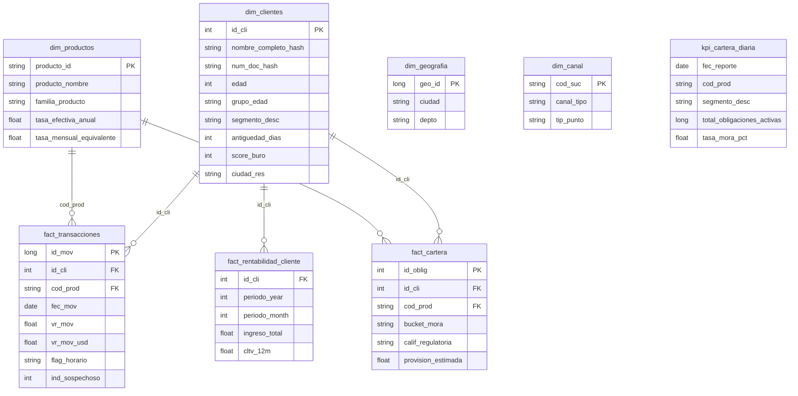

# Diagrama Entidad-Relación — FinBank S.A.

## Modelo de Datos Fuente (Sistema Transaccional)

```mermaid
erDiagram
    TB_CLIENTES_CORE {
        int id_cli PK
        string nomb_cli
        string apell_cli
        string tip_doc
        string num_doc
        date fec_nac
        date fec_alta
        string cod_segmento
        int score_buro
        string ciudad_res
        string depto_res
        string estado_cli
        string canal_adquis
    }

    TB_PRODUCTOS_CAT {
        string cod_prod PK
        string desc_prod
        string tip_prod
        float tasa_ea
        int plazo_max_meses
        float cuota_min
        float comision_admin
        string estado_prod
    }

    TB_SUCURSALES_RED {
        string cod_suc PK
        string nom_suc
        string tip_punto
        string ciudad
        string depto
        float latitud
        float longitud
        int activo
    }

    TB_MOV_FINANCIEROS {
        long id_mov PK
        int id_cli FK
        string cod_prod FK
        string num_cuenta
        date fec_mov
        string hra_mov
        float vr_mov
        string tip_mov
        string cod_canal
        string cod_ciudad
        string cod_estado_mov
        string id_dispositivo
    }

    TB_OBLIGACIONES {
        int id_oblig PK
        int id_cli FK
        string cod_prod FK
        float vr_aprobado
        float vr_desembolsado
        float sdo_capital
        float vr_cuota
        date fec_desembolso
        date fec_venc
        int dias_mora_act
        int num_cuotas_pend
        string calif_riesgo
    }

    TB_COMISIONES_LOG {
        int id_comision PK
        int id_cli FK
        string cod_prod FK
        date fec_cobro
        float vr_comision
        string tip_comision
        string estado_cobro
    }

    TB_CLIENTES_CORE ||--o{ TB_MOV_FINANCIEROS : "id_cli"
    TB_CLIENTES_CORE ||--o{ TB_OBLIGACIONES : "id_cli"
    TB_CLIENTES_CORE ||--o{ TB_COMISIONES_LOG : "id_cli"
    TB_PRODUCTOS_CAT ||--o{ TB_MOV_FINANCIEROS : "cod_prod"
    TB_PRODUCTOS_CAT ||--o{ TB_OBLIGACIONES : "cod_prod"
    TB_PRODUCTOS_CAT ||--o{ TB_COMISIONES_LOG : "cod_prod"
```

## Modelo Dimensional Gold (Star Schema)

```mermaid
erDiagram
    dim_clientes {
        int id_cli PK
        string nombre_completo_hash
        string num_doc_hash
        int edad
        string grupo_edad
        string segmento_desc
        int antiguedad_dias
        int score_buro
        string ciudad_res
    }

    dim_productos {
        string producto_id PK
        string producto_nombre
        string familia_producto
        float tasa_efectiva_anual
        float tasa_mensual_equivalente
    }

    dim_geografia {
        long geo_id PK
        string ciudad
        string depto
    }

    dim_canal {
        string cod_suc PK
        string canal_tipo
        string tip_punto
    }

    fact_transacciones {
        long id_mov PK
        int id_cli FK
        string cod_prod FK
        date fec_mov
        float vr_mov
        float vr_mov_usd
        string flag_horario
        int ind_sospechoso
    }

    fact_cartera {
        int id_oblig PK
        int id_cli FK
        string cod_prod FK
        string bucket_mora
        string calif_regulatoria
        float provision_estimada
    }

    fact_rentabilidad_cliente {
        int id_cli FK
        int periodo_year
        int periodo_month
        float ingreso_total
        float cltv_12m
    }

    kpi_cartera_diaria {
        date fec_reporte
        string cod_prod
        string segmento_desc
        long total_obligaciones_activas
        float tasa_mora_pct
    }

    dim_clientes ||--o{ fact_transacciones : "id_cli"
    dim_clientes ||--o{ fact_cartera : "id_cli"
    dim_clientes ||--o{ fact_rentabilidad_cliente : "id_cli"
    dim_productos ||--o{ fact_transacciones : "cod_prod"
    dim_productos ||--o{ fact_cartera : "cod_prod"
```
